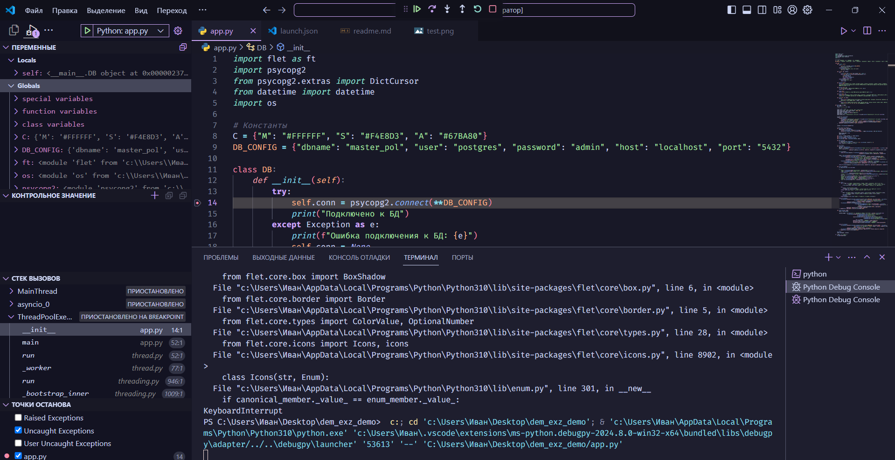
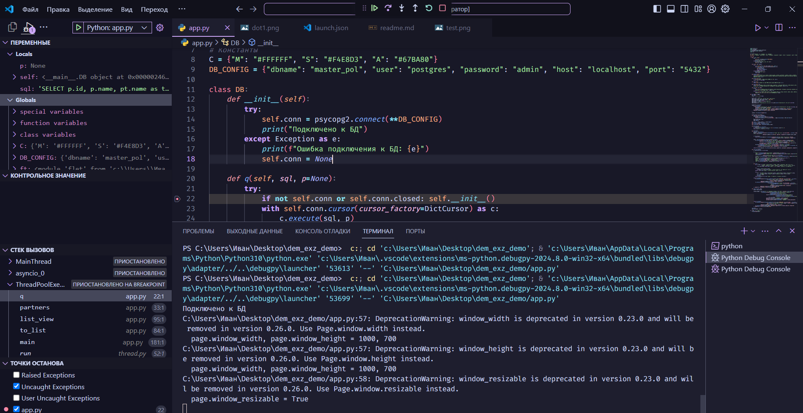
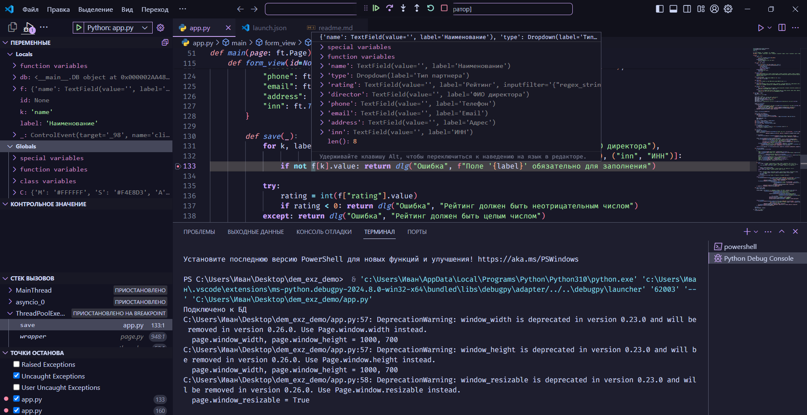
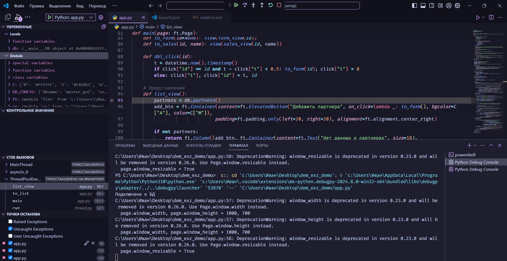
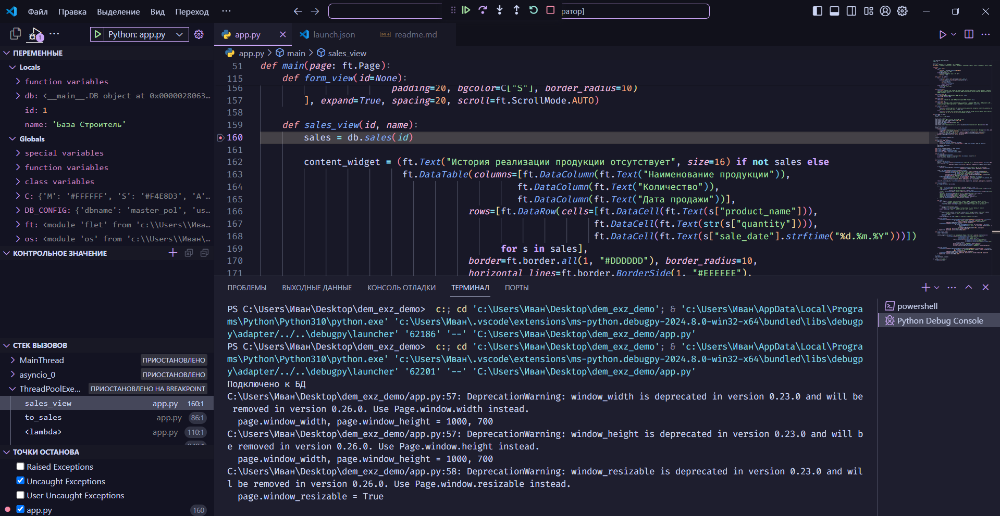
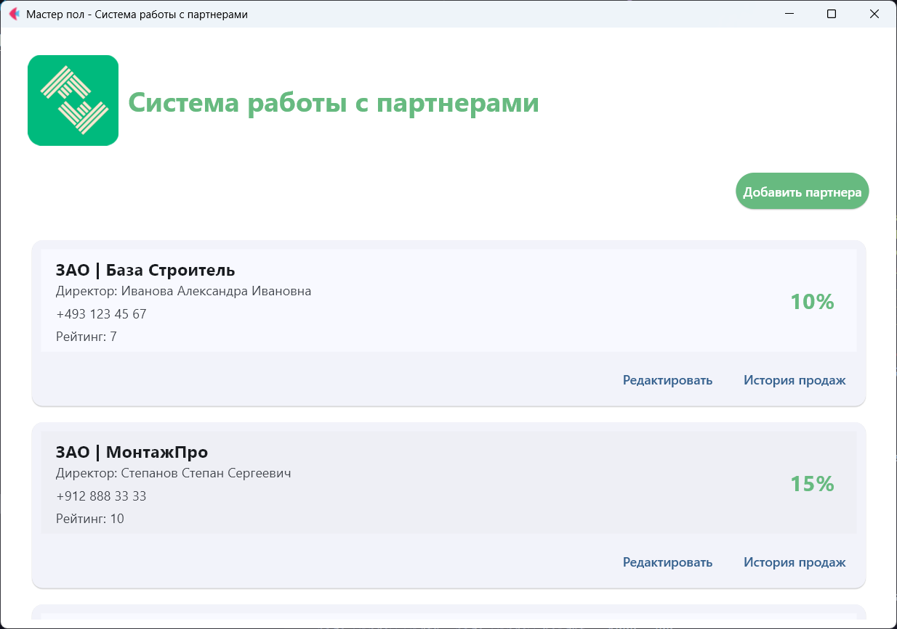
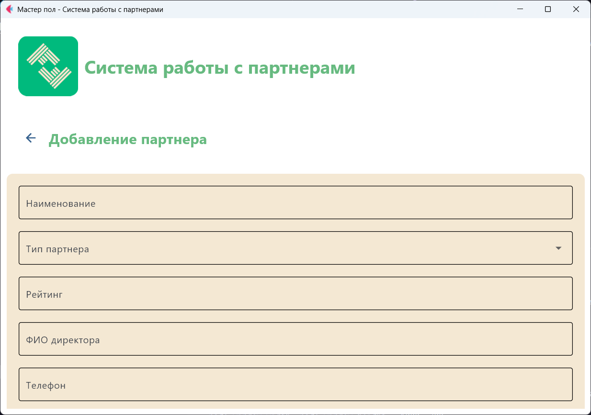
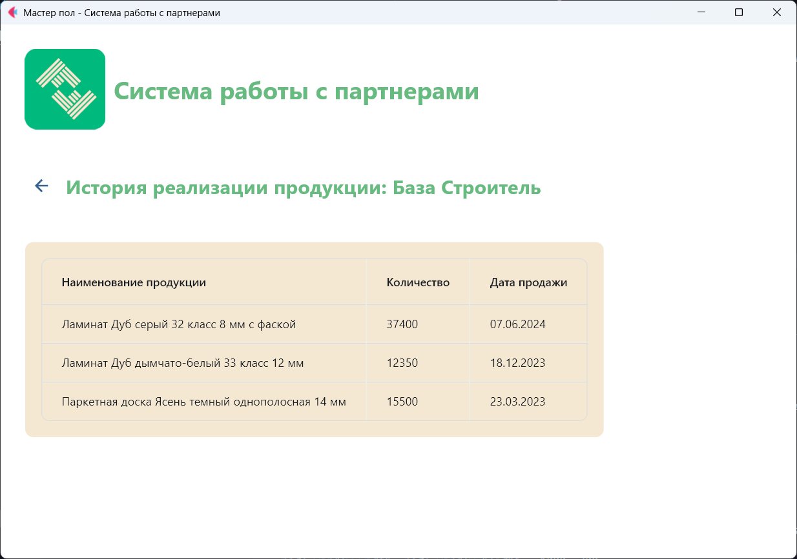
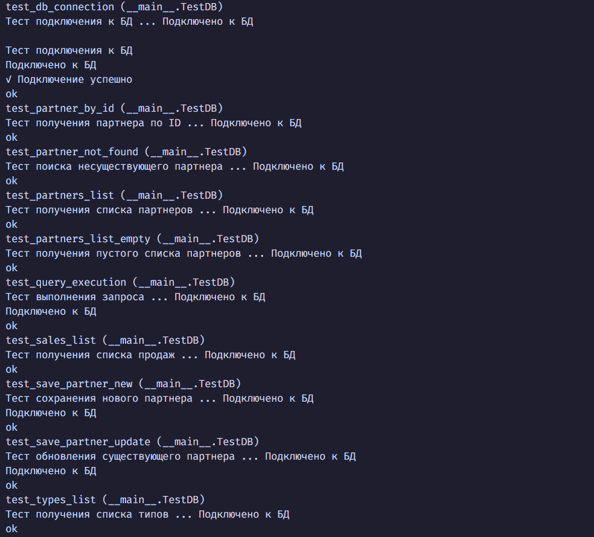

# Система работы с партнерами

## Описание проекта

Это приложение для управления базой данных партнеров компании по продаже напольных покрытий. Программа позволяет просматривать, добавлять и редактировать информацию о партнерах, а также отслеживать историю продаж продукции.

## Основные функции

1. **Просмотр списка партнеров**

   - Отображение всех партнеров в виде карточек
   - Быстрый доступ к основной информации (тип, название, директор, телефон)
   - Отображение текущей скидки для каждого партнера

2. **Добавление и редактирование партнеров**

   - Форма для ввода и обновления данных о партнере
   - Проверка обязательных полей
   - Выбор типа партнера из выпадающего списка

3. **Просмотр истории продаж**
   - Детальная информация о проданных товарах для каждого партнера
   - Сортировка по дате продажи

## Установка и настройка

1. **Создание базы данных**

```bash
psql -U postgres -c "CREATE DATABASE master_pol;"
psql -U postgres -d master_pol -f create_db.sql
psql -U postgres -d master_pol -f import_data.sql
```

2. **Настройка подключения к БД**

В файле `app.py` измените параметры подключения в словаре `DB_CONFIG`:

```python
DB_CONFIG = {
    "dbname": "master_pol",
    "user": "postgres",
    "password": "admin",
    "host": "localhost",
    "port": "5432"
}
```

## Запуск приложения

```bash
python app.py
```

## Руководство по отладке

### Точки останова для отладки

1. **Подключение к базе данных**

   - Файл: `app.py`, строка 15 (метод `__init__` класса `DB`)
   - Позволяет проверить корректность подключения к БД
     

2. **Выполнение SQL-запросов**

   - Файл: `app.py`, строка 22 (метод `q` класса `DB`)
   - Позволяет отследить SQL-запросы и их параметры
     

3. **Сохранение данных партнера**

   - Файл: `app.py`, строка 133 (функция `save` внутри `form_view`)
   - Позволяет убедиться в корректности передаваемых данных
     

4. **Получение списка партнеров**

   - Файл: `app.py`, строка 95 (функция `list_view`)
   - Позволяет проверить получение данных из БД и их отображение
     

5. **Отображение истории продаж**
   - Файл: `app.py`, строка 160 (функция `sales_view`)
   - Позволяет проверить корректность работы с таблицей продаж
     

### Отладка основных функций

#### Типичные проблемы и их решения

1. **Проблема с подключением к БД**

   - Проверьте параметры подключения в `DB_CONFIG`
   - Убедитесь, что PostgreSQL запущен и доступен
   - Проверьте логи сервера PostgreSQL

2. **Ошибки при выполнении SQL-запросов**

   - Проверьте структуру таблиц с помощью `\d имя_таблицы` в psql
   - Убедитесь, что все необходимые таблицы созданы
   - Проверьте правильность параметров в методе `q`

3. **Проблемы с отображением интерфейса**
   - Проверьте наличие файлов ресурсов (логотип, иконка)
   - Убедитесь, что все контролы правильно добавлены на страницу

#### Рекомендации по тестированию

1. Запустите модульные тесты:

```bash
python -m unittest test_app.py
python tests/test_app.py
```

2. Проверьте работу приложения с использованием тестовых данных из `import_data.sql`

## Результаты тестирования

Модульные тесты проверяют следующие функции:

1. **Подключение к БД**

   - Проверка корректности параметров подключения
   - Создание экземпляра класса DB

2. **Выполнение запросов**

   - Проверка корректности выполнения SQL-запросов
   - Обработка результатов запросов

3. **Работа с партнерами**

   - Получение списка партнеров
   - Получение информации о конкретном партнере
   - Добавление нового партнера
   - Редактирование существующего партнера

4. **Работа с продажами**
   - Получение истории продаж для партнера

### Скриншоты для документации

Рекомендуемые места для создания скриншотов:

1. **Главный экран со списком партнеров**

   - Демонстрирует отображение карточек партнеров
   - Показывает расчет скидки для каждого партнера
     

2. **Форма добавления/редактирования партнера**

   - Демонстрирует все поля для ввода данных
   - Показывает работу выпадающего списка с типами партнеров
     

3. **Экран истории продаж**

   - Демонстрирует таблицу с историей продаж
   - Показывает сортировку и форматирование данных
     

4. **Результаты тестирования**
   
